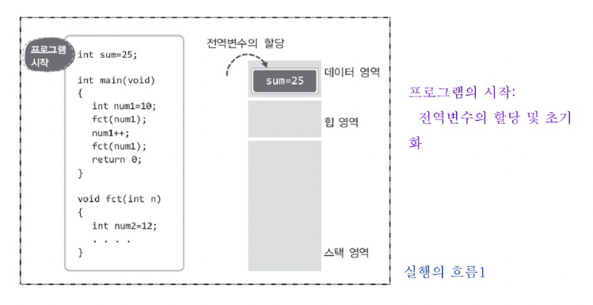

## C를 배울 때 많이들 헷갈릴만한 요소들

### 왜 동적할당이 필요할까?

```C
#include <stdio.h>

char* read_user_name (void)
{
  char name[30];
  printf("What's your name? ");
  gets(name);
  return name;
}

int main(void)
{
  char* name1;
  char* name2;
  name1 = read_user_name();
  printf("name1: %s \n", name1);
  name2 = read_user_name();
  printf("name2: %s \n", name2);
  return 0;
}
```

Q. 무슨 문제가 있을까?

```C
#include <stdio.h>
char name[30];

char* read_user_name (void)
{
  printf("What's your name? ");
  gets(name);
  return name;
}

int main(void)
{
  char* name1;
  char* name2;
  name1 = read_user_name();
  printf("name1: %s \n", name1);
  name2 = read_user_name();
  printf("name2: %s \n", name2);
  
  printf("name1: %s \n", name1);
  printf("name2: %s \n", name2);
  return 0;
}
```

Q. 무슨 문제가 있을까?


#### 메모리 구성

프로그램 실행 시 운영체제에 의해서 마련되는 메모리 구조는 다음과 같이 네 개의 영역으로 구분 된다.


- ##### 코드영역 (Code Area)

  프로그램의 코드가 저장되는 메모리 공간이다.   
  따라서, CPU는 코드 영역에 저장된 명령문들을 하나씩 가져가서 실행한다.

- ##### 데이터 영역 (Data Area)

  전역변수와 static으로 선언되는 static 변수가 할당된다.  
  static 변수란 프로그램의 시작과 동시에 메모리 공간에 할당되어  
  <u>프로그램 종료시까지 남아있게 된다는 특징</u>이 있다.

- ##### 스택 영역 (Stack Area)

  지역변수와 매개변수가 할당된다.  
  이 영역에 할당되는 변수들은 선언된 <u>함수를 빠져나가면 소멸된다는 특징</u>이 있다.

- ##### 힙 영역 (Heap Area)

  데이터 영역과 스택 영역은 생성과 소멸의 시점이 이미 결정되어있다.  
  C언에에서는 <u>프로그래머가 원하는 시점에 변수를 할당하고 또 소멸하도록 지원</u>을 하는 데, 바로 이러한 유형의 변수들이 할당되는 영역이 힙 영역이다. 


##### Example

```C
int sum = 25;

int main(void) 
{
  int num = 10;
  fct(num1);
  num++;
  fct(num1);
 
  return 0;
}

void fct(int n) {
  int num2 = 12;
  ...
}
```




따라서, 우리는 힙 영역에 변수를 선언하고자 한다.  

이를 힙 영역의 메모리 공간 할당과 해제라고 한다.

```c
#include <stdlib.h>
void* malloc(size_t size);
void free(void* ptr);
```


### 왜 malloc 반환형이 void*일까?

왜 malloc 함수의 반환형이 void형 포인터일까?

> void형 포인터란?  
> : 주소 값을 담는 바구니에 지나치지 않음.  그냥 주소를 저장하는 변수


```c
void* ptr = malloc(sizeof(int));
*ptr = 20;
```

다음의 결과는?


void형 포인터는 읽는 방식은 정해지지 않았다.    

- 즉, int형 포인터`int*`는 int형식으로 읽는 **주소 값을 담는 바구니**
- 즉, float형 포인터`float*`는 float형식으로 읽는 **주소 값을 담는 바구니**
- 즉, double형 포인터`double*`는 double형식으로 읽는 **주소 값을 담는 바구니**
- 즉, int*형 포인터`int**`는 int\*형식으로 읽는 **주소 값을 담는 바구니**
  

그럼에도 불구하고 malloc 함수의 반환형이 void형 포인터인 이유가 무엇인가?

> malloc 함수의 답변
>
> "제가 어떻게 포인터 형을 결정합니까? 저에게 전달하는 것은 숫자뿐이자나요.. 4를 전달하시면 int형 변수로 사용할지 float형 변수로 사용할지, 아니면 길이가 4인 char형 배열로 사용할지 제가 어떻게 압니까? 그러니 void형 포인터로 반환하는 수 밖에요."


다음 코드는

```c
void* ptr1 = malloc(sizeof(int));
void* ptr2 = malloc(sizeof(double));
void* ptr3 = malloc(sizeof(int)*7);
void* ptr4 = malloc(sizeof(double)*);
```

다음 코드와 동일하다.

```c
void* ptr1 = malloc(4);
void* ptr2 = malloc(8);
void* ptr3 = malloc(28);
void* ptr4 = malloc(72);
```


그래서 우리는 다음과 같이 읽어야 데이터를 읽을 수 있다.

```c
int* ptr1 = (int*) malloc(sizeof(int));
double* ptr2 = (double*) malloc(sizeof(double));
int* ptr3 = (int*) malloc(sizeof(int)*7);
double* ptr4 = (double*) malloc(sizeof(double)*);
```

<br>

**2학년 전공으로 넘어가기에 앞서 강조 또 강조하고 싶은 것은,  
int형 데이터, double형 데이터 등등.. <u>데이터가 따로 저장되어 있는 것이 아니라,</u>  
데이터는 binary로 저장되어있고, 이를 <u>우리가 어떻게 읽느냐</u>에 따라 데이터의 해석이 달라진다.**

